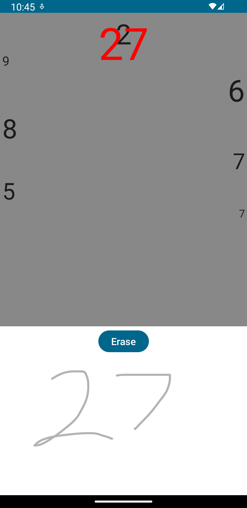
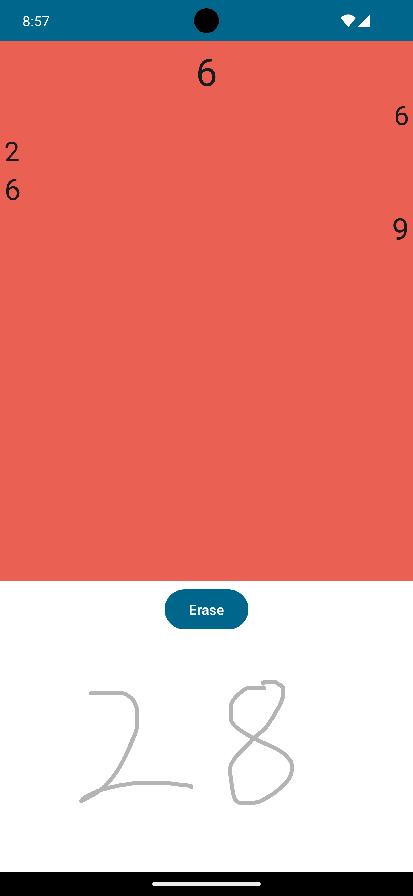

# Numbers
 A **work in progress** simple Android "game" written in compose.

A list of random numbers is generated and shown on the screen. The goal is to add all the numbers and write the answer as quickly as you can.

This uses [ML Kit](https://developers.google.com/ml-kit)'s [digital ink recognition](https://developers.google.com/ml-kit/vision/digital-ink-recognition).

The model used is capable of recognizing latin characters. At the time the digital ink recognition API does not offer a way to load a custom model. It is possible for the model to recognize more than numbers. Everything that is detected and isn't a number is discarded.

The application can work offline after the model is downloaded.

## Status:

    The game isn't playable yet.

* Handwriting recognition works.
* The "board" is generated, although it doesn't look great.
* There should be a countdown to get started and some logic to allow a short period of time to erase anything that was recognized incorrectly.
